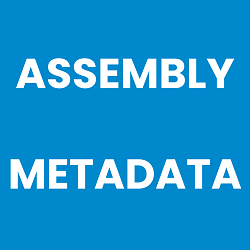

# AssemblyMetadata

<p align="center">
    
</p>

[](https://github.com/BenjaminAbt/AssemblyMetadata/actions/workflows/main-build.yml)
[](https://www.nuget.org/packages/AssemblyMetadata)
[](https://www.nuget.org/packages/AssemblyMetadata)
[](LICENSE)
[](https://dotnet.microsoft.com)

A **Roslyn incremental source generator** that embeds build-time metadata - timestamp, date and
time components - as **compile-time constants** directly into your assembly.
Zero runtime overhead. No reflection. No configuration required.

---

## Table of Contents

- [Why AssemblyMetadata?](#why-assemblymetadata)
- [Installation](#installation)
- [Quick Start](#quick-start)
- [API Reference](#api-reference)
- [Usage Examples](#usage-examples)
  - [Display Build Timestamp](#display-build-timestamp)
  - [Parse into DateTimeOffset](#parse-into-datetimeoffset)
  - [Reconstruct from FileTime (zero-allocation)](#reconstruct-from-filetime-zero-allocation)
  - [Use Individual Components](#use-individual-components)
  - [Build Age Check](#build-age-check)
  - [Health Endpoint](#health-endpoint)
- [How It Works](#how-it-works)
- [Target Frameworks](#target-frameworks)
- [License](#license)

---

## Why AssemblyMetadata?

Knowing *when* an assembly was built is useful for diagnostics, "About" screens, deployment
validation, and telemetry. The traditional approaches all have trade-offs:

| Approach | Runtime cost | Dependency | Works with AOT? |
|---|---|---|---|
| Read `AssemblyInformationalVersion` attribute | Reflection at runtime | None | ⚠️ Limited |
| Embed a resource file with the date | Resource deserialization | Build task | ⚠️ Yes |
| **AssemblyMetadata (this package)** | **Zero - values are `const`** | **None (analyzer only)** | **✅ Yes** |

AssemblyMetadata solves this differently:

- **Compile-time constants** - values are `const`, so the JIT can inline and dead-code-eliminate them
- **Zero-cost access** - reading the timestamp costs nothing beyond a register load
- **No dependencies at runtime** - the NuGet package ships as a Roslyn source generator;
  nothing is added to your runtime dependency graph
- **NativeAOT-compatible** - `const` fields have no reflection or dynamic dispatch
- **Incremental generator** - uses the modern Roslyn `IIncrementalGenerator` API, so the generator
  only re-runs when the compilation changes, keeping build times fast

---

## Installation

Add the package to **any project** that needs build metadata:

```xml
<PackageReference Include="AssemblyMetadata"
                  Version="LATEST_VERSION"
                  OutputItemType="Analyzer"
                  ReferenceOutputAssembly="false" />
```

> **`OutputItemType="Analyzer"`** and **`ReferenceOutputAssembly="false"`** are required.
> They instruct MSBuild to load the package as a Roslyn source generator (not a regular assembly
> reference), producing zero runtime dependencies.

---

## Quick Start

After adding the package, the generated class `AssemblyMetadataInfo` is immediately available
anywhere in your project under the `BenjaminAbt.AssemblyMetadata` namespace:

```csharp
using BenjaminAbt.AssemblyMetadata;

// ISO 8601 UTC timestamp of the build
string timestamp = AssemblyMetadataInfo.BuildInfo.BuildTimestamp;
// → "2026-03-02T14:35:07.1234567+00:00"

Console.WriteLine($"Built on {AssemblyMetadataInfo.BuildInfo.BuildDateYear}-"
                + $"{AssemblyMetadataInfo.BuildInfo.BuildDateMonth:D2}-"
                + $"{AssemblyMetadataInfo.BuildInfo.BuildDateDay:D2} "
                + $"at {AssemblyMetadataInfo.BuildInfo.BuildTimeHour:D2}:"
                + $"{AssemblyMetadataInfo.BuildInfo.BuildTimeMinute:D2}:"
                + $"{AssemblyMetadataInfo.BuildInfo.BuildTimeSecond:D2} UTC");
```

No additional configuration, properties, or attributes are required.

---

## API Reference

The generator produces a single file (`AssemblyMetadataInfo.gen.cs`) in the
`BenjaminAbt.AssemblyMetadata` namespace. All members are `public const`.

### `AssemblyMetadataInfo.BuildInfo`

| Member | Type | Description |
|---|---|---|
| `BuildTimestamp` | `string` | Build time as a UTC ISO 8601 round-trip string (`"o"` format specifier) |
| `BuildFileTimeUtc` | `long` | Build time as a Windows FileTime - 100-nanosecond intervals since 1601-01-01T00:00:00Z |
| `BuildDateYear` | `int` | Year component of the UTC build date |
| `BuildDateMonth` | `int` | Month component of the UTC build date (1–12) |
| `BuildDateDay` | `int` | Day component of the UTC build date (1–31) |
| `BuildTimeHour` | `int` | Hour component of the UTC build time (0–23) |
| `BuildTimeMinute` | `int` | Minute component of the UTC build time (0–59) |
| `BuildTimeSecond` | `int` | Second component of the UTC build time (0–59) |

---

## Usage Examples

### Display Build Timestamp

```csharp
using BenjaminAbt.AssemblyMetadata;

Console.WriteLine(AssemblyMetadataInfo.BuildInfo.BuildTimestamp);
// → 2026-03-02T14:35:07.1234567+00:00
```

### Parse into DateTimeOffset

Use the `"o"` round-trip format specifier to parse the stored constant back into a
`DateTimeOffset` - the same format used by the generator:

```csharp
using System;
using BenjaminAbt.AssemblyMetadata;

DateTimeOffset buildOn = DateTimeOffset.ParseExact(
    AssemblyMetadataInfo.BuildInfo.BuildTimestamp, "o", null);

Console.WriteLine($"Built {(DateTimeOffset.UtcNow - buildOn).Days} days ago.");
```

### Reconstruct from FileTime (zero-allocation)

`BuildFileTimeUtc` lets you reconstruct a `DateTimeOffset` without any string parsing:

```csharp
using System;
using BenjaminAbt.AssemblyMetadata;

DateTimeOffset buildOn =
    DateTimeOffset.FromFileTime(AssemblyMetadataInfo.BuildInfo.BuildFileTimeUtc);
```

This is the fastest way to get a `DateTimeOffset` representation of the build time.

### Use Individual Components

The integer constants allow zero-allocation formatting and direct numeric comparison:

```csharp
using BenjaminAbt.AssemblyMetadata;

// Compose a date string without DateTimeOffset overhead
string buildDate =
    $"{AssemblyMetadataInfo.BuildInfo.BuildDateYear}-"
  + $"{AssemblyMetadataInfo.BuildInfo.BuildDateMonth:D2}-"
  + $"{AssemblyMetadataInfo.BuildInfo.BuildDateDay:D2}";

// Direct year comparison - no parsing, no allocation
if (AssemblyMetadataInfo.BuildInfo.BuildDateYear < 2025)
    Console.WriteLine("Assembly was built before 2025.");
```

### Build Age Check

```csharp
using System;
using BenjaminAbt.AssemblyMetadata;

TimeSpan age = DateTimeOffset.UtcNow
    - DateTimeOffset.FromFileTime(AssemblyMetadataInfo.BuildInfo.BuildFileTimeUtc);

if (age.TotalDays > 30)
    Console.WriteLine($"Warning: this build is {(int)age.TotalDays} days old.");
```

### Health Endpoint

Expose the build timestamp in an ASP.NET Core health or info endpoint:

```csharp
using BenjaminAbt.AssemblyMetadata;

app.MapGet("/info", () => new
{
    BuildTimestamp = AssemblyMetadataInfo.BuildInfo.BuildTimestamp,
    BuildYear      = AssemblyMetadataInfo.BuildInfo.BuildDateYear,
    BuildMonth     = AssemblyMetadataInfo.BuildInfo.BuildDateMonth,
    BuildDay       = AssemblyMetadataInfo.BuildInfo.BuildDateDay,
});
```

---

## How It Works

AssemblyMetadata uses the modern **Roslyn incremental source generator** API
(`IIncrementalGenerator`). The generator is registered against the compilation provider so it
fires for every new compilation.

The generated file never appears on disk; it lives only in the in-memory compilation.
Because all members are `const`, the C# compiler inlines them at every call site - no method
call, no property access, no object allocation.

### Why All Values Are Derived from One `DateTimeOffset`

`BuildSource` receives a single `DateTimeOffset buildOn` parameter and derives all eight
constants from it. Calling `DateTimeOffset.UtcNow` only once guarantees that
`BuildTimestamp`, `BuildFileTimeUtc`, and every date/time component refer to the exact same
instant, with no possibility of clock skew between fields.

---

## Target Frameworks

The source generator itself targets `netstandard2.0` because it runs inside the Roslyn/MSBuild
host process. The consuming project can target any framework supported by Roslyn source generators:

| Framework | Supported |
|---|---|
| .NET 10 | ✅ |
| .NET 9 | ✅ |
| .NET 8 | ✅ |
| .NET Standard 2.0+ | ✅ |
| .NET Framework 4.6.2+ | ✅ |

---

## License

[MIT](LICENSE) © [BEN ABT](https://benjamin-abt.com/)

Please donate - if possible - to institutions of your choice such as child cancer aid,
children's hospices, etc. Thanks!
